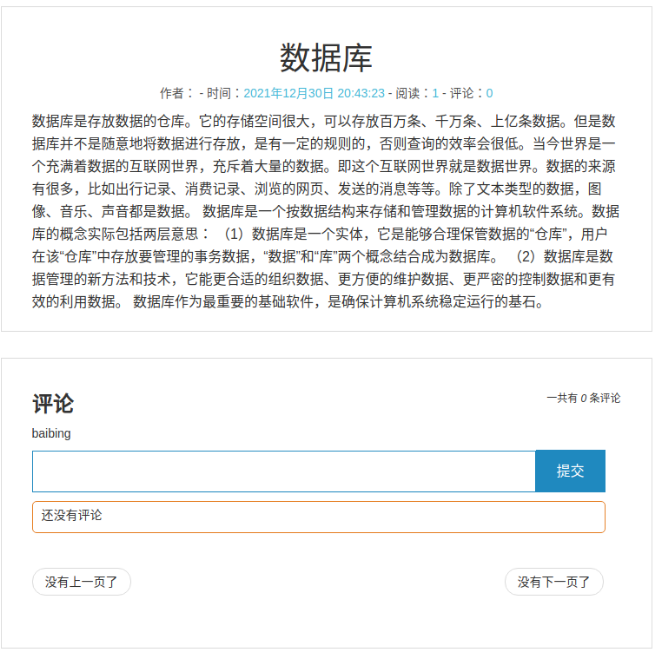

# 项目说明

- ## 项目名称：个人博客平台

  ### 1.项目设计部分

- 开发时间：2021.12.16~2021.12.30

- 开发环境：B/S类型的信息管理系统或信息处理系统;系统编程语言为nodejs;数据库使用mongodb;后端框架express.

  1）项目总体构成

  作为一个个人博客平台，主要分为管理员和用户两种不同的身份，包括注册登陆，博客发表和查看，评论与回复，点赞与转发等基本功能。用户可以发表和查看博文，也可以评论和回复，对博客进行点赞和转发；管理员可以对用户进行管理，查看所有已经注册过的用户，实现对博客的分类管理：添加分类和编辑删除分类，同时管理员也可以查看已经·发布的所有博文，修改和删除它们，也拥有所有其他用户的功能。

  2）本项目使用bootstrap、ejs、mongoose、expess等包。

  bootstrap：Bootstrap是前端开发中比较受欢迎的框架，简洁且灵活。它基于HTML、CSS和JavaScript，HTML定义页面元素，CSS定义页面布局，而JavaScript负责页面元素的响应。Bootstrap将HTML、CSS和JavaScript封装成一个个功能组件，用起来简单，粗暴。

  

  ejs：EJS是一个简单高效的模板语言，通过数据和模板，可以生成HTML标记文本。可以说EJS是一个JavaScript库，EJS可以同时运行在客户端和服务器端，客户端安装直接引入文件即可，服务器端用npm包安装

  

  mongoose:Mongoose 是一个让我们可以通过Node来操作MongoDB数据库的一个模块
  Mongoose 是一个对象文档模型（ODM）库，它是对Node原生的MongoDB模块进行了进一步的优化封装;大多数情况下，他被用来把结构化的模式应用到一个MongoDB集合，并提供了验证和类型装换等好处;基于MongoDB驱动，通过关系型数据库的思想来实现非关系型数据库

  

  express：Express 是一个简洁而灵活的 node.js Web应用框架, 提供了一系列强大特性帮助你创建各种 Web 应用，和丰富的 HTTP 工具。使用 Express 可以快速地搭建一个完整功能的网站。

  3）项目目录结构和各个部分的说明

  ​         （1）项目目录结构

  

  

  

  

    （2）项目各个部分使用说明

  node_modules：项目安装的各个包

  public:网页图标，css、js文件
  
  view:admin、main、user文件夹
  
  #### models：
  
  - User.js:用户信息模型类
  - Category.js:分类信息模型类(导航栏信息)
  - Content.js:博文信息模型类
  - Connect.js:连接数据库
  
  #### routes:
  
  - app.js:入口文件
  - api.js:用户操作接口文件
  - admin.js:管理员后台管理操作文件
  - user.js:用户操作后台管理文件

  ### 2.使用说明书

  #### 前台：

  用户首页:

  用户登陆（用户登陆和管理员登陆）：输入用户名密码，后台数据库进行查询核对，若信息无误则进入用户界面!

  

  若信息有误则显示用户名和密码错误

  

  登陆成功则显示：

  

    用户注册：点击用户注册进行注册，注册后挑战到原来界面，用户信息添加到数据库中。

  

  

  若信息没有填写完整则显示：

  

  退出：点击右侧退出按钮来退出，进入登录页面。

  

  分类页：

  

  详情页展示（数据查询显示）：

  

  阅读博文：点击阅读全文即可进入相应博文详情页，平时可以在低下评论，点击提交该评论将会被显示出来。

  

  转发点赞功能

  

  点击转发则显示：

  

  点击点赞显示：同时点赞数后台数据库加1并显示。!(../../190110910503/云计算期末笔记/doc/image-20211230044439684.png)

  

  #### 后台：

  管理员管理：

  

  注册用户管理

  

  博 客分类管理

  

  博客编辑：

  

  博客分类添加：

  

  博客内容

  

  博文修改

  
  
  博文发布
  
  
  
  评论的管理功能
  

### 3.开发日记

开发前先安装mongodb数据库，然后新建一个目录，安装express+mongoose

开发前先安装mongodb数据库，**mongoose** 是使用nodejs对mongodb数据库的操作进行了抽象和封装，有以下几个概念：**Schema**、**Model**、**Document**
 **Schema**: `模式`, 类似于关系数据库中的表的概念
 **Model**: `模型` 负责和底层MongoDB数据库进行交互
 **Document**：`文档` 表示存储在MongoDB中的数据的一对一映射。每个文档都是其模型的一个实例

接下来先起一个node 服务：

API  server.js

然后建立Schema和Model

blogModel.js
**mongoose.model()**第一个参数是类似关系数据库中的表名，在数据库中建立时默认会加s，即在数据库中呈现的是blogs

数据集合

然后写API的处理函数

当新增blog的时候可以看到先 new blog(),这个blog就是前面的

每条博客数据都是一个Document，都是blogModel的一个实例，但是在查询、删除、修改等操作的时候不需要再new一个Model实例

接下来就是将服务器和mongodb数据库连接到一起

最后是完成项目上传到github

完成部署。

